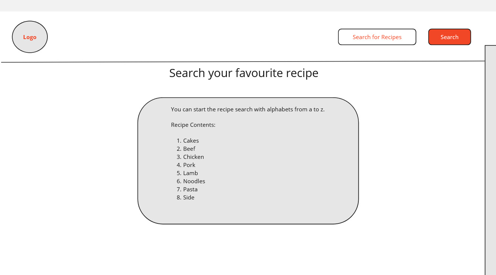
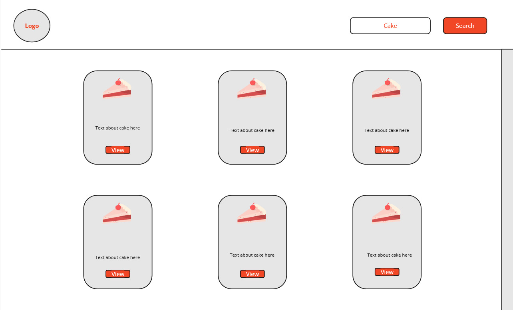
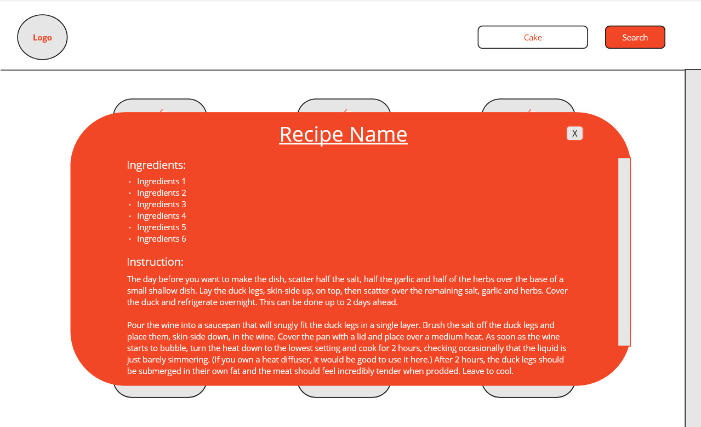
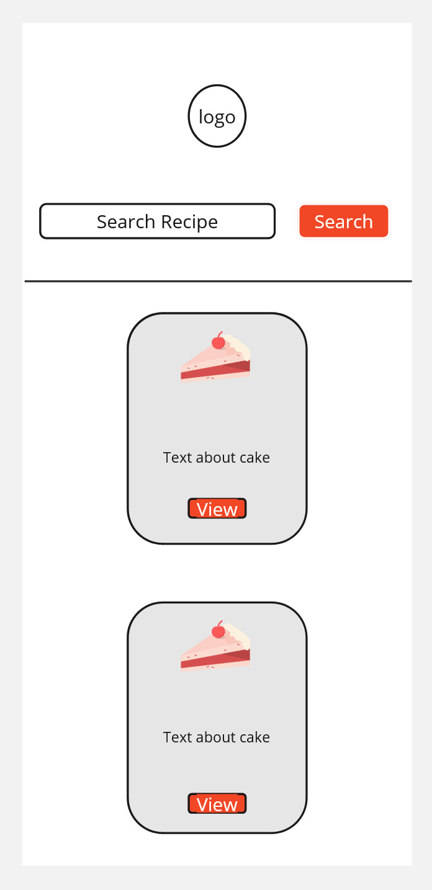
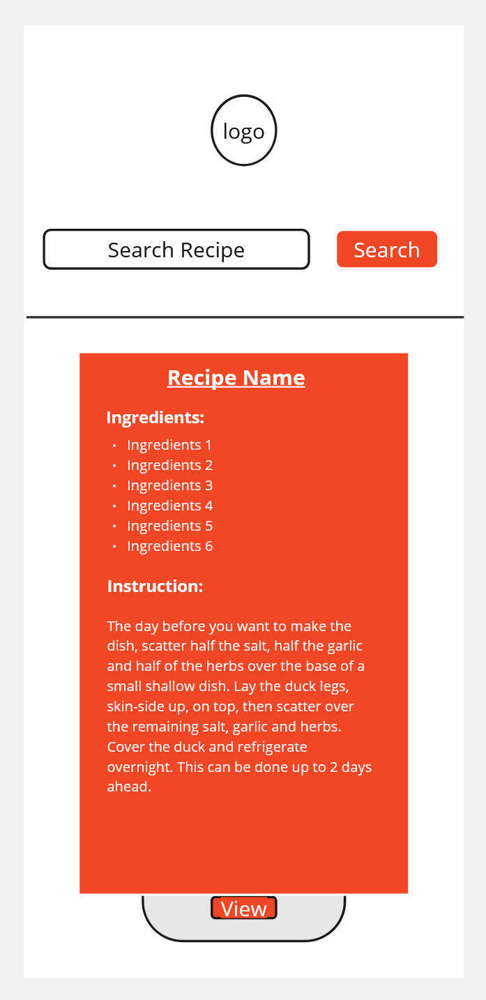

# Milestone project 2 - Interactive Frontend Development

<a href="https://ocyrus47.github.io/milestone2/" target="_blank"> Link to milestone 2 project / Interactive Frontend Development </a>

This is a responsive "Recipe Finder" app allowing the user to search their input for various catogeries of dishes. 

## SDLC Process

### Planing
I decided to build a responsive recipe finder web app to align the project with assisting my cousin to learn cooking. Planing was taken into consideation with a view for further recipes to be added to the portfolio. 

### Analysis
Carried out research with individuals in my community who were keen on learning to cook. Most of them answered they use various cook books to find new dishes and recipes. Which meant for a certain recipe cook book a price was very high and it was often clunky to carry around while cooking. A recipe finder app with a simple search capabilities for various dishes and recipes would be more costeffective and give the developers capabilites to update new recipies on user demand.

### Design
The structure and UI of the app has been designed to ensure simplicity and ease of navigation to suit its intended audience.

<ol>
    <li>The user is able to able to go back to the home page with a single click of a button to the icon located at the top left of the header.</li>
    <li>The use can search for any recipe by just entering a single alphabet which will give out the list of recipies to choose from.</li>
    <li>If the user does not input any search criteria, they will be prompted to input a search criteria.</li>
    <li>Once the user has made a search by clicking the search button, they can view the recipies in grid.</li>
    <li>Mouse hoover over zoom effect is applied for users to verify their selection and they can view the recipe details by click the "view recipe" button.</li>
    <li>Recipe details will apprear in a modal dialog window with custon scroll bar on the right.</li>
    <li>Once the user has finished viewing the recipe, the can simply click the X button at the top right corner of the modal dialog window.</li>
</ol>

### Implementation
Researched on the best practice for implementation process and applied agile methodology. Changes were made in conjuction with quick sprint session with volunteers on UI/UX. 

### Testing
Used manual and auto testing method by direct input. Screen shots and details of testing below.

Please follow [Testing File](./testing.md), for testing documentation

### Maintainance
I will carry out maintainance by my own account via Gitpod (VS Code) and Github. I am looking to implement further functionalities and upgrade UI/UX features.

## User Experience (UX)

### App contents

- Header with logo and search input field.
- Search button to allow the use to execute search for recipe
- Keywords manuel for users to search the recipe. 

### Target Audience

- keen individuals interested in trying different recipes
- Rookie indivisuals interested in learning to cook or bake
- Individuals looking to explore new recipies
- Anyone with cooking hobby

### Project purpose

It starded from an idea for my sister when she left for her University. Being away from home and not have being the best cook we discussed how she would be able to cook as someone who didn't cook. 

The purpose of this app is to equip anyone who is looking to learn how to cook or bake. The app must be very simple and specific to finding dishes and recipes. It must have very good design principles allowing the user to vision ther end product and facilitae them to view the recipe very quickly. 

### User stories

<ol>
    <li>As a new user, I do not want to go through the process of creating a profile to view recipies.</li>
    <li>As a user, I want to be able see the recipe contents available in the app.</li>
    <li>A a user, I want to be able to navigate through the app UI seamlessly.</li>
    <li>A a user, I want to be able to view the the dish images and the name along with the recipe.</li>
    <li>As a user, I want to be able to use the app in my mobile and ipads so I can follow the recipe while cooking.</li>
</ol>

### Project Scope

#### The following feature will be in scope for this project

- Index page with dish and recipe contents and manual.
- Ability to search recipes and dishes using aplhabets or dish name .
- Recipes starting with the alphabets will show up in grid blocks with name and view button.
- View button in searched recipe will open the details for the recipe.
- Empty input will prompt the user with alert.
- Invalid recipe or dish name will prompt the user with alert.

#### Possible future implementations currently out of scope include:

- Implement a contact us page for user to suggest any recipes they would like to add to the app. 
- Create a sign up process allowing the user to login the app and favourite certain dish and recipe. 
-  Creating comment sections in for each recipe to build user cummunity.

## Accessibility

The site has been built with accessibility in mind to ensure that it is always a positive experience.

This has been achieved by:
- Semantic HTML.
- Choosing fonts and colours with high contrast.
- Adequate aria-labels for interactive features.
- Adequate alt attributes for images.

## Wireframes

### Index section for APP

### Recipe Grid after app returns user's search

### Recipe details after user click view recipe button

### Mobile UI - Recipe Grid after app returns user's search

### Mobile UI - Recipe details after user click view recipe button

### Strategy

My goal in the design was to make it as easy as possible to access information on the site while striving for a minimalist and easy to navigate UX design.

---

### Technologies

<ul>
    <li>HTML 5</li>
    <li>CSS</li>
    <li>Javascript</li>
    <li>Google Chrome Dev Tools</li>
    <li>lighthouse test</li>
    <li>Github</li>
    <li>Gitpod</li>
    <li>Miro</li>
    <li>Open API from (https://www.themealdb.com/api.php)</li>
    <li>Mr Free Logo Maker (https://myfreelogomaker.com/)</li>
    <li>Font Awesome</li>
    <li>Google Fonts</li>
    <li>Media Queries</li>
</ul>

### Languages

<ol>
    <li>HTML</li>
    <li>CSS</li>
    <li>JavScript</li>
</ol>

---

## Features

### Existing features

- The site features a responsive design, ensuring accessibility across all device sizes.
- All images are of high quality and are accessed through API.
- The design is simple, providing an immediate understanding of the app's purpose with an ease of use.
- The site consists of a single page, making it easy to navigate and simple to use.

The header consists of app logo, a search field for recipes and dishes for the user and a search button to execute the search. The index page also has a manual directing the user on various keywords to begin their search to access the recipe. 

#### Wrong input

If the use type in wrong input in the search field they will be prompted with an alert and message for wrong input. In order for the user to reset the search they simple needs to click to app logo. 

#### No/Null input

If the user does not type anything in the search field and executes the search button they will be prompted with an alert and a message showing  Null input. 

### Features to implement

- Contact us page for users to suggest any recipes they would like to add to the app. 
- Sign up form allowing the user to create their account and login the app.
- Allow logged in users to favourite certain dish and recipe they are keen to try.
-  Create comment section for each recipe to build user cummunity and activity in the app. 

---

### Project Outcome

Overall, the project successfully meets all client goals and, after extensive testing, fulfills each criterion established for its purpose.

---

### Devices

Google Developer Tools was used to test the site on various device sizes.

The following devices were used to test the app:
- 32" (3840 x 2160) Samsung Desktop Monitor
- 15" (1920 x 1080) ASUS Nitro Laptop
- iPad Tablet
- iPhone 11 Pro Mobile

---

### Browsers

The following browsers were used to test the app:
- Google Chrome
- Mozilla Firefox

## BUGS found and Resolution

NULL input - If the user clicks search button without any input results shown in random. So I added the if statement to the searchInput function to alert the user to input valid input. I also changed innerHTML for recipeContainer to put in the following message "Please type the recipe you want to seach to begin. Thank you!<" to guide the user. 

---

### All of the code in this project is done by me

## Credits

### Acknowledgements

- My tutor for guidance throughout the project.
- Code Institute for their course material.
- My cousing for her feedback, help and support throughout the project.
- [Programming with Mosh.](https://www.youtube.com/@programmingwithmosh)

---

### Resources

- [W3 Schools](https://www.w3schools.com/css/css3_flexbox.asp) for reference throughout the project.
- [Stack overflow](https://stackoverflow.com/) for 
- [MND](https://developer.mozilla.org/en-US/docs/Web/JavaScript) for reference on JavaScript.
- [YouTube](https://www.youtube.com/) for reference throughout the project.
- [CodeAcademy mobile App](https://www.codecademy.com/) free version exercises for learning the concepts for JS ES6 syntax. 
- [Programming with Mosh.](https://www.youtube.com/@programmingwithmosh) for familirising JS ES6 syntax.