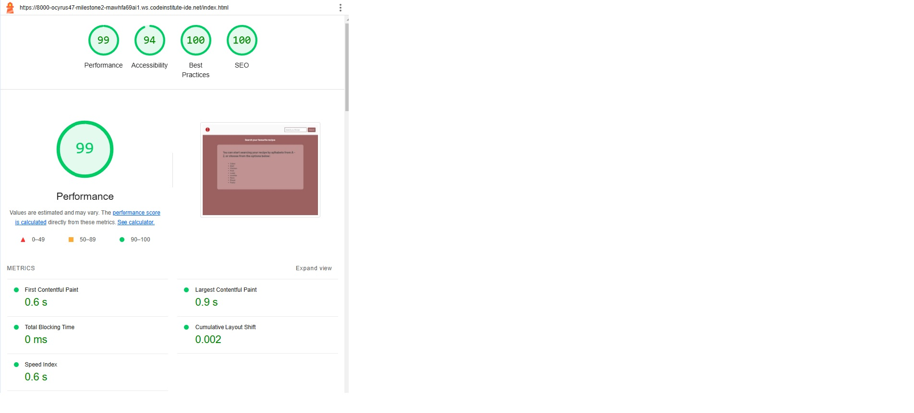

# 📋 **Testing Documentation**

## The principles or manual and automated testing

### Manual Testing

Manual testing is a process in software testing where testers manually execute test cases without relying on automation tools. The main goal is to identify defects, bugs, or issues by ensuring that the application's features function as intended, based on the specified requirements.

During manual testing, testers simulate end-user interactions with the software to verify its functionality, usability, and overall performance.

#### When to Use Manual Testing

Manual testing is suitable for the following scenarios:

<ul>
<li>Exploratory Testing: When test cases are not well-defined, and the tester needs to explore the software.
</li>

<li>Usability Testing: To evaluate the user-friendliness and overall experience.
</li>

<li>Short-term Projects: When the project timeline is brief and does not justify the setup of automation.
</li>
</ul>

---

### Automated Testing

Automated testing, also known as automation testing, is a software testing method where test cases are executed automatically using specialized tools, scripts, and frameworks. Unlike manual testing, which requires human intervention, automated testing relies on predefined scripts to efficiently handle repetitive, complex, and time-consuming tests.

Its primary goal is to enhance testing speed, accuracy, and coverage while minimizing human involvement, especially in regression, performance, and large-scale testing.

#### When to Use Automated Testing

Automated testing is most beneficial in the following scenarios:

<ul>
<li>Regression Testing: To quickly verify that recent code changes haven’t introduced new bugs.
</li>

<li>Load and Performance Testing: To evaluate how the application performs under different conditions.
</li>

<li>Repetitive Tests: When tests need to be run frequently, such as nightly builds or continuous integration pipelines.
</li>

<li>Data-driven Testing: For tests that require multiple iterations with different input data.
</li>
</ul>

---

## Testing

This app code was validate by using W3C CSS Validation Service, W3C Markup Validation Service and lighthouse. 

Testing was conducted throughout the entire project development phase. Google Developer Tools and [JSHint](https://jshint.com/) were utilized to identify errors and troubleshoot any issues that arose during development.

Automated testing helps catch problems quickly and saves time by letting the computer do repetitive tasks instead of the developer. 

---

### Code Validation

#### HTML Validation

[W3C Markup Valication Service](https://validator.w3.org/ 'link to Markup validator')

---

#### CSS Validation

[W3C CSS Validation Service](https://jigsaw.w3.org/css-validator/ 'link to CSS validator')

#### HTML 404 Validation

[W3C Markup Valication Service](https://validator.w3.org/ 'link to Markup validator')

---

#### Javascript Validation

---

#### Highscore Validaiton

---

### Lighthouse testing

**Desktop performance test**

Screenshot for desktop Performance test

---

**Mobile performance test**

Screenshot for mobile performance test

---

### Accessibility testing

**Accessibility testing for Desktop**

Screenshot for Desktop accessibility test

---

**Accessibility testing for mobile**

 

Screenshot for Mobile accessibility test

---

### Test carried out for Best Practice and SEO 

**Best Practice and SEO testing for Desktop**

Screenshot for Desktop SEO and Best Practice

---

**Best Practice and SEO testing for Mobile**

Screenshot for Mobile SEO and Best Practice

---

### Testing User stories

1. I want the app to be simple to navigate and use.
    * The app consists of one page with everything it provides.
    * The app has a simple structure, making it easy to navigate.
    * The app contains only necessary content.
    * The structure remains the same on all device sizes.
    * The app follows good accessibility principles.

2. I want the app to be accessible on multiple platforms (such as web, mobile, and tablets), so that users can play it on their preferred devices.
    * The app has been designed with a mobile first approach.
    * The app is responsive on all device sizes.

3. I want the app to have a visually appealing interface with good design principles, so that it attracts and engages users from the moment they visit.
    * The app follows a consistent design.
    * The colours used are in good contrast and follow the theme of the app.
    * The interface is simple yet pleasing, keeping the user engaged.

4. I want the app to show the user a manual to assist the user with their recipe search.
    * The app follows a consistent design. 
    * The colours are used in good contrast and follows the theme of the app.
    * The direction for search option is clearly visible to the user.

5. I want the app to have to ability to prompt the user if their input in invalid or NULL. 
    * The app will prompt alert message notifying the user of invalid input.
    * The message in background will change to ask the use to input correct recipe.

6. I want the app to produce the search results in a grid view of all the recipies when the search button is triggered with the correct search input. 
    * The app will show a responsive grid of recipes.
    * The app will transition the selected recipe to ease-in-out to upon mouse over. 
    * The mouse pointer will apply to create a more easire UI for the user. 

7. I want the app to pop out recipe details page when the user clicks the view recipe button in the grid view.
    * The app will show the recipe details contents in a pop up page.
    * The app follows a consistent design. 
    * The colours are used in good contrast and follows the theme of the app.

8. I want the app to close the pop out recipe details page when close button is clicked. 
    * The close button will highlight to change change color when cursor over. 
    * The pop up page is closed when the close button is clicked. 

### Functionality testing

#### App page load

| Action                        | Expected Result    | Pass/Fail|
| ----------------------------- |--------------------|----------|
| Site URL entered into browser | Site loads         | Pass     |

#### Responsiveness

| Action                        | Expected Result    | Pass/Fail|
| ----------------------------- |--------------------|----------|
| Test on mobile device         | Responsive         | Pass     |
| Test on tablet device         | Responsive         | Pass     |
| Test on laptop device         | Responsive         | Pass     |
| Test on desktop               | Responsive         | Pass     |

#### Search for recipe

| Action                        | Expected Result                       | Criteria met Y/N|
| ----------------------------- |---------------------------------------|-----------------|
| Invalid Input                 | Alert pop up / Message changed in app | Y               |
| Valid Input                   | Menu grid view shown                  | Y               |
| Null Input                    | Alert pop up / Message changed in app | Y               |

#### Hover orver and mouse point on menu grid for valid search

| Mouse over effect on grid menu                                                             | Criteria met Y/N | 
| -------------------------------------------------------------------------------------------|------------------|
| Menu grid transition to ease - in  out                                                     |         Y        |

#### Menu details pop page on view recipe button click

| View recipe putton clicked                                                                 | Criteria met Y/N | 
| -------------------------------------------------------------------------------------------|------------------|
| Pop up page with recipe details opens                                                      |         Y        |

#### Close menu details pop up page on close button click

| Close button clicked in pop up recipe details page                                         | Criteria met Y/N | 
| -------------------------------------------------------------------------------------------|------------------|
| Pop up page with recipe details closes                                                     |         Y        |

#### Click app logo to reset the search 

| Click app logo                                                                             | Criteria met Y/N | 
| -------------------------------------------------------------------------------------------|------------------|
| Reset the search criteria                                                                  |         Y        |